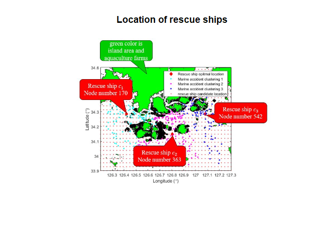
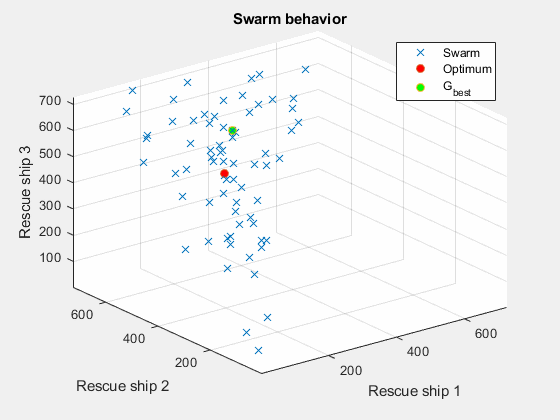

Combinatorial Optimization using PSO
================
Andres Fernando Garcia
6/14/2021


## Project details

This project consists of performing [combinatorial
optimization](https://en.wikipedia.org/wiki/Combinatorial_optimization)
to select the best group of 3 rescue ships in order to attend marine
accidents. There are 725 rescue ships distributed in a particular ocean
region with a high level of maritime activity.



The number of possible combinations is:


One accident should be assigned to the nearest rescue ship, considering
all accidents. As a constraint condition, an accident must be assigned
to a rescue ship within 30 nautical miles, no matter how far.

The objective function of the problem is:


subject to


where

  - n is the number of marine accidents (n=366)
  - x\_i is the i-th marine accident
  - c is the center of the rescue ship (3 rescue ships)

The selected distance between each rescue ship and the registered marine
accidents (366) is the [euclidean
distance](https://en.wikipedia.org/wiki/Euclidean_distance#:~:text=In%20mathematics%2C%20the%20Euclidean%20distance,being%20called%20the%20Pythagorean%20distance.).

## Results

To solve the optimization problem, the Particle Swarm Optimization
([PSO](https://en.wikipedia.org/wiki/Particle_swarm_optimization#:~:text=In%20computational%20science%2C%20particle%20swarm,a%20given%20measure%20of%20quality.&text=The%20algorithm%20was%20simplified%20and%20it%20was%20observed%20to%20be%20performing%20optimization.))
algorithm is implemented using MATLAB. The parameters used in the
simulation were:

``` r
# PSO initialization
swarm_size = 70                # number of the swarm particles
maxIter    = 150               # maximum number of iterations
inertia    = 0.93
c_local    = 0.4               # influence of the best local                     
c_global   = 0.3               # influence of the best global
```

The following image shows the behavior of each particle in the
simulation.



The node number of the best three rescue ships locations is (170, 363,
542).
